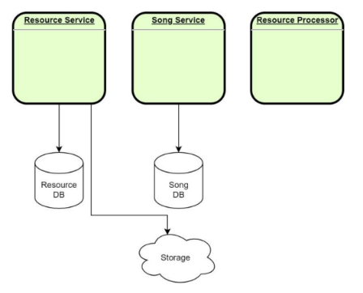
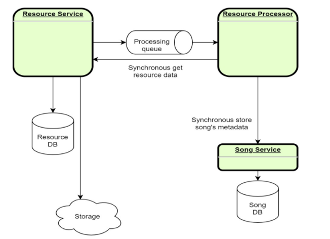
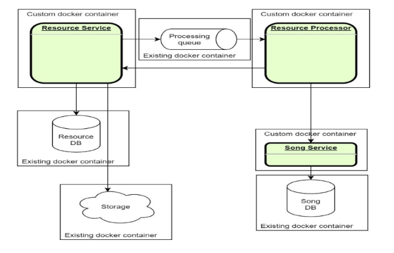
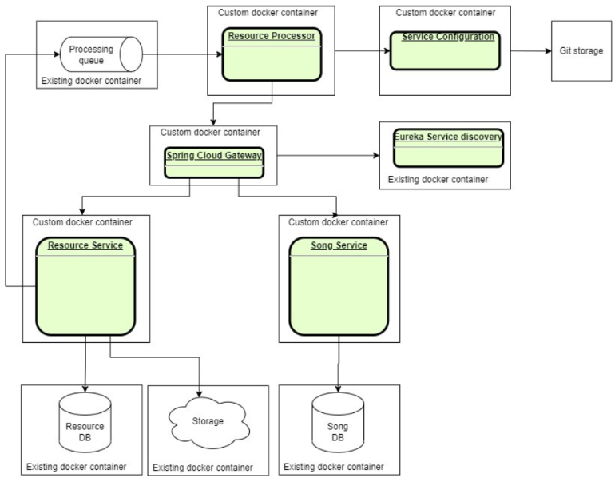

# jmp.microservices-fundamental

Practical course oriented to building Microservices Architecture. It is aimed to show of microservices architecture,
learn tools, technologies and patterns that are more commonly used in microservices architecture such as API Gateway,
Service Discovery, Circuit Breaker.

#### Modules:

<u><strong>Module 1: Architecture overview</strong></u>

#### Table of Content

- [What to do](#what-to-do)
- [Sub-task 1: Resource Service](#sub-task-1-resource-service)
- [Sub-task 2: Resource Processor](#sub-task-2-resource-processor)

### What to do

To execute this module, should be used a ready-made artifact obtained after executing
the [introduction-to-microservices](https://git.epam.com/epm-cdp/global-java-foundation-program/java-courses/-/tree/main/introduction-to-microservices)
program and make some changes to the base structure of microservices system.
During this task you need to:

+ Make structural changes to existing microservices:
    - **Resource Service**

+ Implement a new microservice:
    - **Resource Processor**

### Sub-task 1: Resource Service

For a **Resource Service**, it is recommended to make structural changes as described bellow.

- **Resource Service** should use cloud storage or its emulation (
  e.g. [S3 emulator](https://github.com/localstack/localstack)) to store the source file. Previously, the resource file
  was stored in the service database.
- Resource tracking (with resource location in the cloud storage) should be carried out in the underlying database of
  the service.

When uploading a mp3 file, the **Resource Service** should process the file in this way:

- Save the source file to a cloud storage or its emulation (
  e.g. [S3 emulator](https://github.com/localstack/localstack)).
- Save resource location (location in the cloud storage) in the underlying database of the service.
- The **Resource Service** should not invoke any other services this time.

### Sub-task 2: Resource Processor

This service will be used to process the source MP3 data in the future and will not have a web interface. At this point,
this should be a basic Spring Boot application capable of extracting MP3 metadata for further storage using the **Song
Service** API.
An external library can be used for this purpose.(
e.g. [Apache Tika](https://www.tutorialspoint.com/tika/tika_extracting_mp3_files.htm)).

Implement initial version of each service:

- Basic structure (Spring Boot)

## NOTES:

- After start localstack should run initialization hook that create s3 bucket from
  script `docker-compose/scripts/localstack/init-s3.sh`

- Localstack endpoints

    - access to s3 busket: [http://localhost:4566/localstack-s3-bucket](http://localhost:4566/localstack-s3-bucket)
      where `localstack-s3-bucket` name of existing bucket;
    - Health check
      localstack: [localhost.localstack.cloud:4566/_localstack/health](localhost.localstack.cloud:4566/_localstack/health)

<u><strong>Module 2: Microservices communication</strong></u>

#### Table of Content

- [What to do](#what-to-do)
- [Sub-task 1: Asynchronous communication](#sub-task-1-asynchronous-communication)
- [Sub-task 2: Events handling](#sub-task-2-events-handling)
- [Sub-task 3: Retry mechanism](#sub-task-3-retry-mechanism)

### What to do

In this module it is needed to adjust services created in the first module with adding cross-servers calls.

### Sub-task 1: Asynchronous communication

1) Add asynchronous communication via messaging broker between **Resource Service** and **Resource Processor**.
2) On resource uploading, **Resource Service** should send information about uploaded resource to the **Resource Processor**, which contains “resourceId”.

[Rabbit MQ](https://hub.docker.com/_/rabbitmq), [ActiveMQ](https://hub.docker.com/r/rmohr/activemq) or any other broker usage is possible.

### Sub-task 2: Events handling

1) When the **Resource Processor** has an event of receiving message, it uses a synchronous call to get the resource data (binary) from the **Resource Service**, parses the metadata, and uses the synchronous call to save the metadata of the song in the **Song. Service**.
2) Need to implement some way of queue listening/subscription. For example, [Rabbit Spring Streams](https://docs.spring.io/spring-cloud-stream-binder-rabbit/docs/current/reference/html/spring-cloud-stream-binder-rabbit.html).

### Sub-task 3: Retry mechanism

While implementing communications between services it’s necessary to think about implementation of **Retry Mechanism**, e.g: [Retry Pattern](https://docs.microsoft.com/en-us/azure/architecture/patterns/retry).
Implementation can be based on the [Spring Retry Template](https://docs.spring.io/spring-batch/docs/current/reference/html/retry.html) or annotations for both synchronous and asynchronous communication.

**Note**

For this module you could use any of the messaging brokers for asynchronous communication (it’s better to discuss with expert).

## NOTES

- To create Queue, Exchange and Binding should processor (application processor).

<u><strong>Module 3: Testing</strong></u>

#### Table of Content

- [What to do](#what-to-do)
- [Sub-task 1: Testing strategy](#sub-task-1-testing-strategy)
- [Sub-task 2: Perform different types of testing](#sub-task-2-perform-different-types-of-testing)

### What to do

In this module it is needed to adjust services with adding tests.

### Sub-task 1: Testing strategy

1) For solving this task, come up with a testing strategy and describe approach on how to ensure application stability and testing strategies:
- Unit tests
- Integration tests
- Component tests
- Contract tests
- End-to-end tests
2) Describe it in a short document what approach was chosen and how the combination of the strategies would help to solve task, e.g., either it's going to be 100% **unit tests** and **integration tests** or something else.

### Sub-task 2: Perform different types of testing

1) _Unit tests_: choose JUnit or Spock and choose module that need to be tested.
2) _Integration tests_: choose JUnit or Spock and cover integration layers.
3) _Component tests_: cover component scenarios on a business level, specifying exact scenario or scenarios and expected outcomes in a natural language, preferably using the Cucumber framework.
4) _Contract tests_: cover all contracts that are used in a specific scenario, preferably using the [Spring Cloud Contract](https://spring.io/projects/spring-cloud-contract) or Pact (contract tests should cover BOTH communication styles: synchronous HTTP and messaging, including stubs propagation).
5) _End-to-end tests_: all scenarios should be described in a natural language. Focus is on coverage on the API layer. Cucumber testing framework can be used in this case with the component tests from above.

**Note**

- At least one test should be executed for each test type.

<u><strong>Module 4: Containerization</strong></u>

#### Table of Content

- [What to do](#what-to-do)
- [Sub-task 1: Docker images](#sub-task-1-docker-images)
- [Sub-task 2: Docker Compose file](#sub-task-2-docker-compose-file)

### What to do

In this module you will need to adjust your services with containerization approach.

### Sub-task 1: Docker images

1) Package your applications as Docker images.
2) For each of your services:
- Create a new or modify an existing _Docker_ file that will contain instructions for packaging your project.
- Build a docker image and run it, mapping an external port to verify that application can be started and respond to requests.

### Sub-task 2: Docker Compose file

1) When all applications are successfully packaged, create a new or modify an existing _docker-compose.yml_ file that would list all applications and 3rd party dependencies to successfully start the project.
   Add init scripts for the database to run when container starts up. Once you have a compose file, you can create and start your application containers with a single command: `docker-compose up`.

Please note the following:
- Use an _.env_ file to replace all environment variables depending on the set-up.
- For 3rd party dependencies try to use the _–alpine_ images whenever it's possible.
- For project applications use the build property as these images are not going to be pulled from a public hub.
- Use logical service names to cross-reference services.

Possible container options for existing resources:

- [postgres DB](https://hub.docker.com/_/postgres)
- [mysql db](https://hub.docker.com/_/mysql)
- [RabbitMQ message broker](https://hub.docker.com/_/rabbitmq)
- [ActiveMQ message broker](https://hub.docker.com/r/rmohr/activemq)
- [Local stack (aws emulator)](https://hub.docker.com/r/localstack/localstack)

<u><strong>Module 5: Service Discovery</strong></u>

#### Table of Content

- [What to do](#what-to-do)
- [Sub-task 1: Service Registry](#sub-task-1-service-registry)
- [Sub-task 2: API Gateway](#sub-task-2-api-gateway)
- [Sub-task 3: Service Configuration (Optional)](#sub-task-3-service-configuration-optional)

### What to do

In this task, it is needed to change the configuration to use the existing **Service Registry** tool.
Sample implementation: [Eureka Example](https://www.javainuse.com/spring/cloud-gateway-eureka)

### Sub-task 1: Service Registry

1) Update infrastructure of configuration to make sure that **Service Registry** is launched along with existing services.
2) Update clients using Eureka so that they will be called by service name instead of ip:port.
3) Implement Client-Side Balancing.

### Sub-task 2: API Gateway

1) Use API Gateway implementation - Spring Cloud Gateway.
2) Update infrastructure configuration to make sure that API Gateway is launched, exposed and there is a single-entry point in application.
3) Make sure that all services receive traffic from external clients through the API Gateway.
4) Properly handle errors (e.g., if service is not found or route doesn't exist).

### Sub-task 3: Service Configuration (Optional)

1) Create Git repository for storing all needed configuration at one place.
2) Create a service which will play the role of Service Configuration for other services.
3) Update infrastructure configuration by changing one (or more) services so to be able to communicate with Service Configuration.
4) Make sure that all service config clients receive configuration from Service Config.
5) Update service config client to be able to refresh configuration in case it was changed.

**Note.** In case there are issues with running all services on your local machine, for example, not enough CPU range or RAM, here are the following options:

- use [docker limits](https://docs.docker.com/config/containers/resource_constraints/)
- use any cloud free tier system if it’s possible
- use [EPAM Cloud](https://kb.epam.com/display/EPMCITFAQ/Personal+Projects)

### NOTES
- **Spring MVC is incompatible with Spring Cloud Gateway.**

    Please set `spring.main.web-application-type=reactive` or remove `spring-boot-starter-web` dependency.

